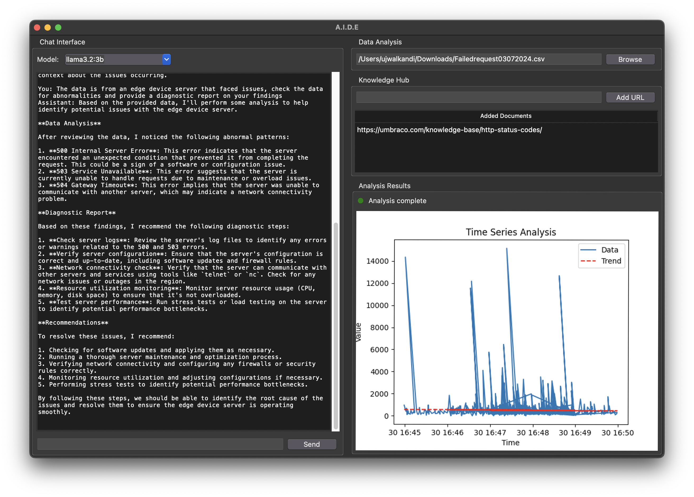

- Built an AI tool to analyze logs locally, identify issues, and provide diagnostic reports.
- Utilized Llama models on Groq, implemented RAG with ChromaDB, and created visualizations with SciPy for enhanced analysis.
- Developed the initial prototype at the [ATX Llama Hackathon](https://cerebralvalley.pixieset.com/austinhackathon/) hosted by Meta, where I used the [Llama Stack](https://github.com/meta-llama/llama-stack) for on-device intelligence.
