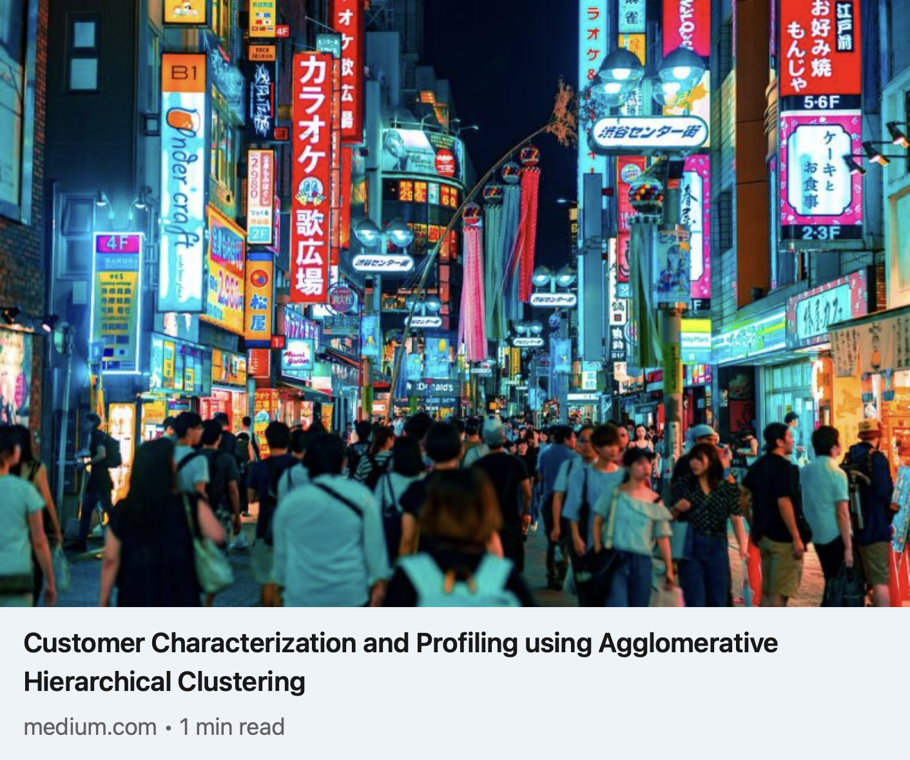

- Conducted comprehensive analysis of client habits, demographics, and marketing responses using different clustering techniques.
- Opted for Agglomerative Hierarchical Clustering, gaining deeper insights into distinctive customer segments.
