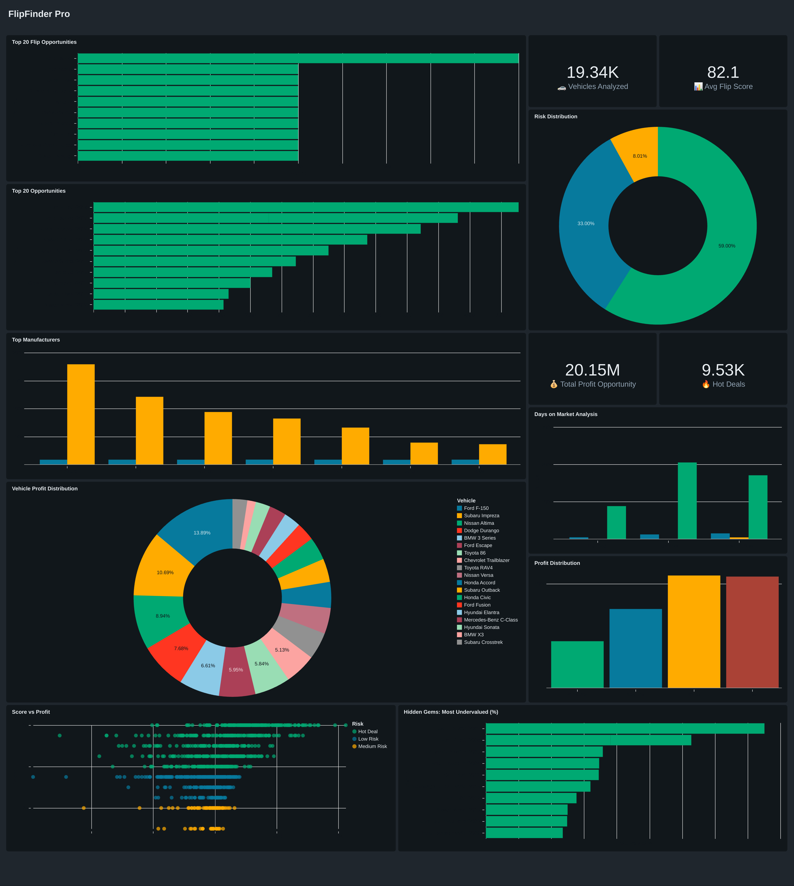

- Built for the Databricks Free Edition Hackathon — an ML and anomaly-detection model that analyzes used-car data, predicts market values with 89%+ accuracy, and surfaces high-profit flip opportunities.
- Developed an interactive analytics dashboard that reveals flip scores, risk levels, profit potential, and $20M+ worth of opportunities.
