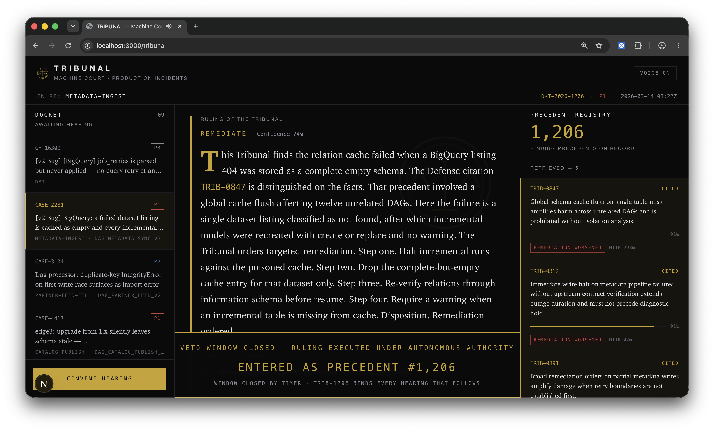

- Built an adversarial AI court that decides whether to change production during an incident: a Prosecution, a Defense, and a Judge LLM argue each case, citing evidence and past rulings, before a ruling is issued.
- Every ruling passes through a human veto window enforced by Flink, then is logged to a Kafka precedent registry on Confluent Cloud that every later hearing must argue against.
- Developed at the [Cursor Austin × AITX Hackathon](https://aitx-cursor-hackathon-showcase.vercel.app/projects/tribunal) as a successor to [A.I.D.E.](/projects/#aide), using Next.js, TypeScript, Claude structured outputs, Zod, and Supabase pgvector, with cases drawn from real Airflow and dbt failures.
