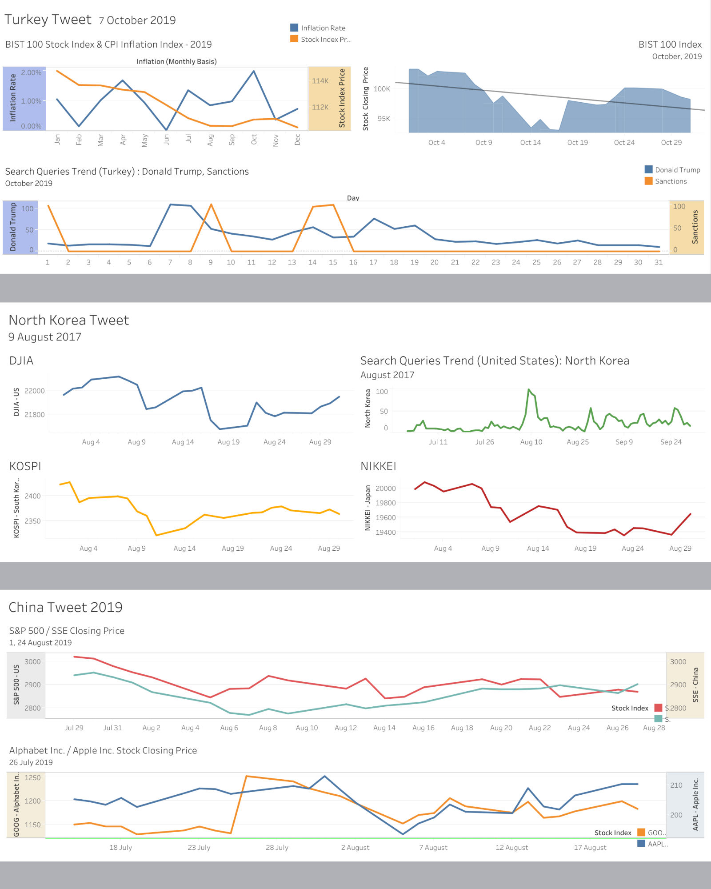

[Research Paper](https://arxiv.org/abs/2101.03205) 📑

<strong>Correlation Viz</strong>

- Scrapped vital tweets of world leaders from a Tweet Archive and analyzed their financial impact on global stock markets.
- Applied several Data Visualization techniques to indicate the correlation between the two factors.
